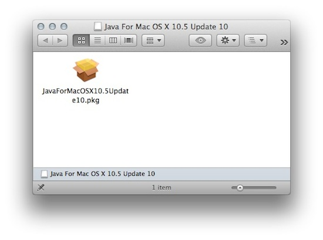
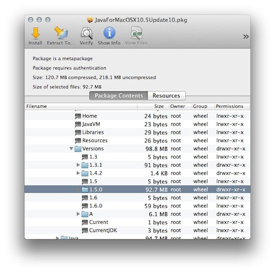
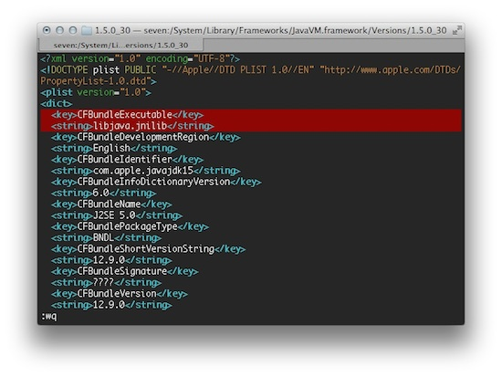
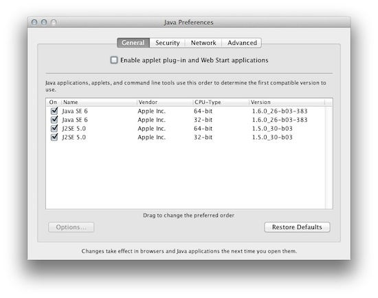

**Java 1.5 for OS X Lion**

1.  [[Download]](http://support.apple.com/downloads/DL1359/en_US/JavaForMacOSX10.5Update10.dmg) the
    official Java package from Apple, [[Java for Mac OS X 10.5 Update
    10]](http://support.apple.com/kb/DL1359) and mount the
    disk image.\
    

2.  Register a copy (you\'ll be happy you did) of CharlesSoft\'s
    must-have
    utility [[Pacifist]](http://www.charlessoft.com/) to
    view the package contents within.

3.  Open a terminal and get a root shell:\
    \
    **% sudo -s**

4.  Change to the JavaVM Framework Versions directory:\
    \
    **\# cd /System/Library/Frameworks/JavaVM.framework/Versions**

5.  Remove the 2 symlinks for Java 1.5:\
    \
    **\# pwd**\
    /System/Library/Frameworks/JavaVM.framework/Versions\
    **\# rm -i 1.5**\
    remove 1.5? **y**\
    **\# rm -i 1.5.0**\
    remove 1.5.0? **y**

6.  Use *Pacifist* to open *JavaForMacOSX10.5Update10.pkg* in the disk
    image you downloaded in step 1 and navigate to*System \> Library \>
    Frameworks \> JavaVM.framework \> Versions*\
    

7.  Select 1.5.0, right-click, and choose *Install to Default Location*.
    When asked, *Use Administrator Privileges*.

8.  Back in the terminal, rename the newly installed *1.5.0* directory
    to *1.5.0_30*:\
    \
    **\# pwd**\
    /System/Library/Frameworks/JavaVM.framework/Versions\
    **\# mv -v 1.5.0 1.5.0_30**\
    1.5.0 -\> 1.5.0_30

9.  Create symbolic links to *./1.5.0_30* for *1.5* and *1.5.0*:\
    \
    **\# pwd**\
    /System/Library/Frameworks/JavaVM.framework/Versions\
    **\# ln -sivh ./1.5.0_30 1.5**\
    1.5 -\> ./1.5.0_30\
    **\# ln -sivh ./1.5.0_30 1.5.0**\
    1.5.0 -\> ./1.5.0_30\
    **\# ls -Fld 1.5\***\
    lrwxr-xr-x 1 root wheel 10 Jul 21 14:28 1.5@ -\> ./1.5.0_30\
    lrwxr-xr-x 1 root wheel 10 Jul 21 14:29 1.5.0@ -\> ./1.5.0_30\
    drwxr-xr-x 9 root wheel 306 Jul 21 14:26 1.5.0_30/

10. Change into *1.5.0_30* and use *vi* (or *nano*) to
    edit *./Resources/Info.plist*:\
    \
    **\# cd 1.5.0_30**\
    **\# pwd**\
    /System/Library/Frameworks/JavaVM.framework/Versions/1.5.0_30\
    **\# vi ./Resources/Info.plist**

11. Edit the value for key *JVMMaximumFrameworkVersion*:\
    \
    \<key\>JVMMaximumFrameworkVersion\</key\>\
    \<string\>**14.\*.\***\</string\>

12. Edit the value for key *JVMMaximumSystemVersion*:\
    \
    \<key\>JVMMaximumSystemVersion\</key\>\
    \<string\>**10.7.\***\</string\>

13. Add a new key and string value for *CFBundleExecutable* as the first
    element of the main *\<dict\>* node:\
    \
    \<plist version=\"1.0\"\>\
    \<dict\>\
    **  \<key\>CFBundleExecutable\</key\>\
      \<string\>libjava.jnilib\</string\>**

14. Save and exit your editor.\
    

15. Create a symbolic link to *./Resources/Info.plist* in
    the *1.5.0_30* directory:\
    \
    **\# pwd**\
    /System/Library/Frameworks/JavaVM.framework/Versions/1.5.0_30\
    **\# ln -siv ./Resources/Info.plist .**\
    ./Info.plist -\> ./Resources/Info.plist\
    **\# ls -Fl Info.plist**\
    lrwxr-xr-x 1 root wheel 22 Jul 21 14:01 Info.plist@ -\>
    ./Resources/Info.plist

16. Create a directory *./MacOS* in the *1.5.0_30* directory change to
    it:\
    \
    **\# pwd**\
    /System/Library/Frameworks/JavaVM.framework/Versions/1.5.0_30\
    **\# mkdir -v ./MacOS**\
    mkdir: created directory \'MacOS\'\
    **\# cd ./MacOS**

17. Create a symbolic link to *../Libraries/libjava.jnilib* in
    the *MacOS* directory:\
    \
    **\# pwd**\
    /System/Library/Frameworks/JavaVM.framework/Versions/1.5.0_30/MacOS\
    **\# ln -siv ../Libraries/libjava.jnilib .**\
    ./libjava.jnilib -\> ../Libraries/libjava.jnilib\
    **\# ls -Fl libjava.jnilib**\
    lrwxr-xr-x 1 root wheel 27 Jul 21 14:11 libjava.jnilib@ -\>
    ../Library/libjava.jnilib

18. Change to the Java Virtual Machines directory and create
    a *1.5.0* directory:\
    \
    **\# cd /System/Library/Java/JavaVirtualMachines**\
    **\# pwd**\
    /System/Library/Java/JavaVirtualMachines\
    **\# mkdir -v 1.5.0**\
    mkdir: created directory \'1.5.0\'\
    **\# ls -Fl**\
    drwxr-xr-x 2 root wheel 68 Jul 21 14:40 1.5.0/\
    drwxr-xr-x 3 root wheel 102 Jun 29 00:26 1.6.0.jdk/

19. Change to the *1.5.0* directory and Create a symbolic
    to *1.5.0_30* called *Contents*:\
    \
    **\# cd 1.5.0**\
    **\# pwd**\
    /System/Library/Java/JavaVirtualMachines/1.5.0\
    **\# ln -sivh
    /System/Library/Frameworks/JavaVM.framework/Versions/1.5.0_30
    ./Contents**\
    ./Contents -\>
    /System/Library/Frameworks/JavaVM.framework/Versions/1.5.0_30\
    **\# ls -Fl**\
    lrwxr-xr-x 1 root wheel 61 Jul 21 16:40 Contents@ -\>
    /System/Library/Frameworks/JavaVM.framework/Versions/1.5.0_30

20. Run *Java Preferences.app* in your *Utilities* folder and check
    for *Java 1.5*. If it doesn\'t show, go back and double check your
    work.\
    
